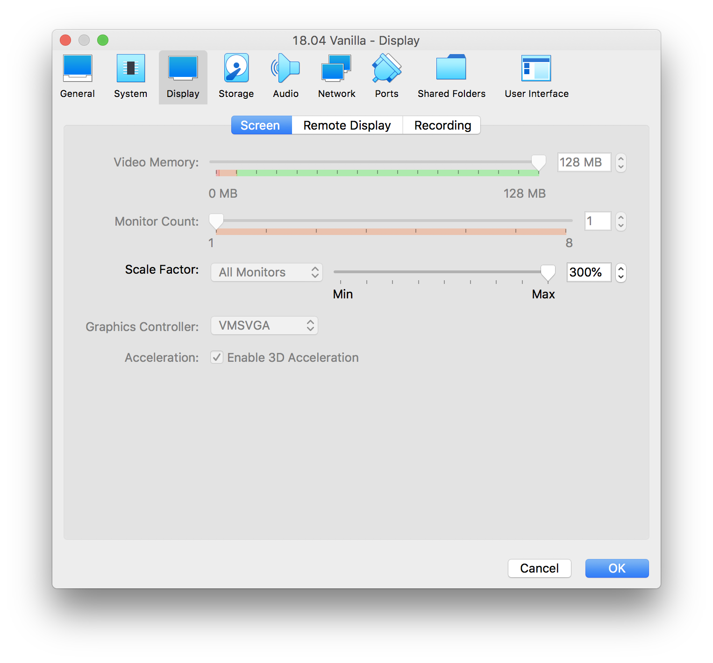

# Installing Hyperledger Besu on Linux

## Introduction

This section will describe how to install Ubuntu on Virtual Box for those who do not run Linux natively. Oracle VM VirtualBox is a cross-platform, free and open source virtualisation application. In other words, using  VirtualBox, one can run multiple operating systems on a single computer. Ubuntu is a popular free and open-source Linux distribution based operating system on Debian. Ubuntu is officially released in three editions; desktop, server, and core of which we will be using the desktop version.

### Download VirtualBox

Download VirtualBox for your operating system at [https://www.virtualbox.org/wiki/Downloads](https://www.virtualbox.org/wiki/Downloads) and follow the [documentation](https://www.virtualbox.org/wiki/End-user_documentation) if you get stuck.


In VirtualBox under Devices, select "Insert Guest Additions CD image..." as well as "Shared Clipboard" &gt; Bidirectional to allow copying and pasting into and out off VirtualBox. Remember to restart VirtualBox machine for the settings to take effect.



Ensure at least 4Gb of memory is allocated to the VirtualBox machine and increase the video memory to maximum and enable 3D acceleration to increase performance. 




### Download Ubuntu

We will be using the latest version of Ubuntu desktop which can be downloaded at: [https://ubuntu.com/download/desktop](https://ubuntu.com/download/desktop). 

### Start in Terminal

Open up terminal and create a folder called Besu in the home directory. Change into this directory and use wget to download the desired version of Besu from [https://pegasys.tech/solutions/hyperledger-besu/](https://pegasys.tech/solutions/hyperledger-besu/). The example below uses Besu 1.3.8.

```bash
cd ~
mkdir Besu
cd Besu
wget https://bintray.com/api/ui/download/hyperledger-org/besu-repo/besu-1.3.8.tar.gz
```

Extract the file and then navigate into the bin folder and test the Besu version command

```bash
 tar -xvf besu-1.3.8.tar.gz 
 cd besu-1.3.8/bin/
 ./besu --version
```

### Error

At this point, an error should occur.

```bash
ERROR: JAVA_HOME is not set and no 'java' command could be found in your PATH.

Please set the JAVA_HOME variable in your environment to match the
location of your Java installation.
```

This is because Besu requires Java 11 or greater to be present. To install Java, run:

```bash
javac --version
Command 'javac' not found, but can be installed with:

sudo apt install default-jdk            
sudo apt install openjdk-11-jdk-headless
sudo apt install ecj                    
sudo apt install openjdk-8-jdk-headless 
```

This will show the options of how to install Java. Use the first option.

```bash
sudo apt install defaulk-jdk
```

### Success

Once this is completed, then re-run the Besu version command. This should yield the following output.

```bash
./besu --version
besu/v1.3.8/linux-x86_64/openjdk-java-11
```

