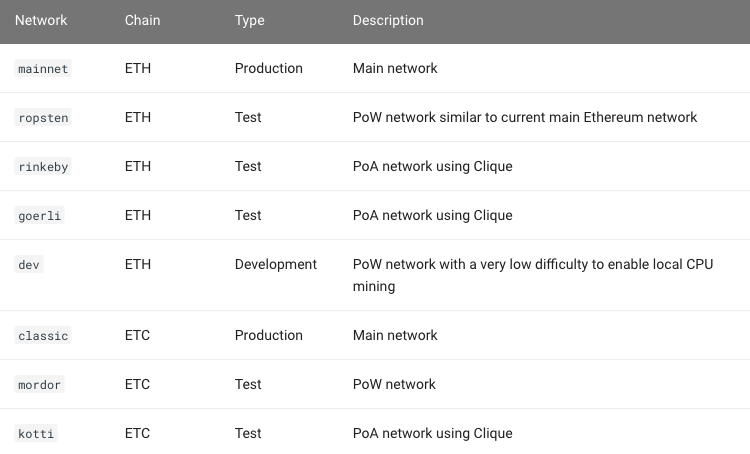

# Changing the Besu network

In this section, we'll learn how to change the network that Besu is connected to. We previously learnt that the default network when starting up Besu is MainNet. However, we can use the [--network](https://besu.hyperledger.org/en/stable/Reference/CLI/CLI-Syntax/#network) flag to change the network to other TestNets such as Ropsten, Rinkeby, or Classic just to name a few. 



When starting Besu, it is a good practise to actually always include the --network flag to help make it explicit what network is being used. Therefore, let's improve on our previous command when starting Besu with the following.

```text
./besu --network=mainnet --rpc-http-enabled
```

If we stop Besu \(ctrl+c\) and restart with a different network such as

```text
./besu --network=ropsten --rpc-http-enabled
```

we will actually get an error "Supplied genesis block does not match stored chain data". Please specify a different data directory with --data-path or specify the original genesis file with --genesis-file".

What has happened is that the two different networks are trying to use the same "database" folder that contains the blockchain. The first network connected, be it MainNet or another TestNet has the genesis file set up for that network. Connecting to one network while using the genesis file of another network will cause this error. 

A quick way to fix this is to delete the "database" folder before repointing Besu to the new network. A better solution is to change the name and location of this database folder which will be explored in the next section.


Fun fact: Testnets are named after train stations as a convention, usually where the respective testnet maintainers are based from.

* Morden: a subway station in London 
* Ropsten: a metro station in Stockholm 
* Rinkeby: a metro station in Stockholm 
* Kovan: a subway station in Singapore


