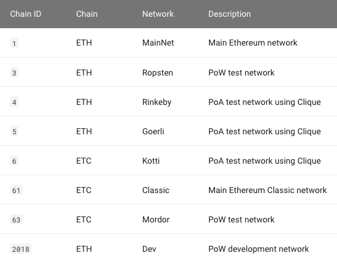

# Checking the Besu network

To check the network that the Besu client is connected to, open up a new terminal and run the following command.

```text
curl -X POST --data '{"jsonrpc":"2.0","method":"net_version","params":[],"id":1}' localhost:8545
```

You should get the following error "curl: \(7\) Failed to connect to localhost port 8545: Connection refused". This is because the [rpc-http-enabled](https://besu.hyperledger.org/en/stable/Reference/CLI/CLI-Syntax/#rpc-http-enabled) flag needs to be included when starting up Besu. Restart Besu with this flag as follows.

```text
./besu --rpc-http-enabled
```

The following successful json result should be returned.

```text
{
  "jsonrpc" : "2.0",
  "id" : 1,
  "result" : "1"
}
```

A result of "1" represents the chain ID from the [net\_version](https://besu.hyperledger.org/en/stable/Reference/API-Methods/#net_version) method API call. 




./besu --rpc-http-enabled=true will also work.


