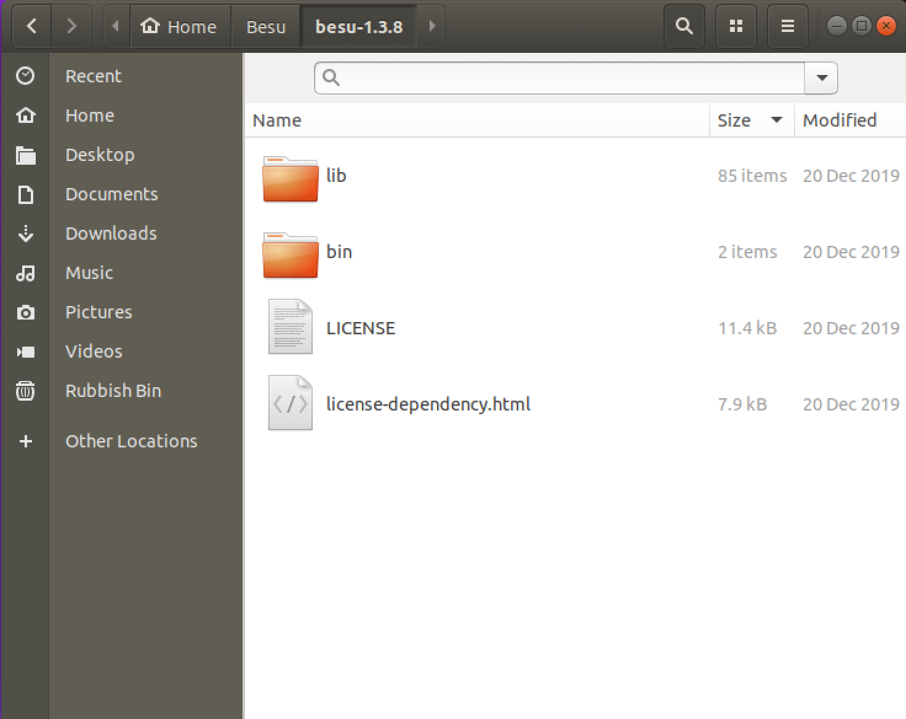
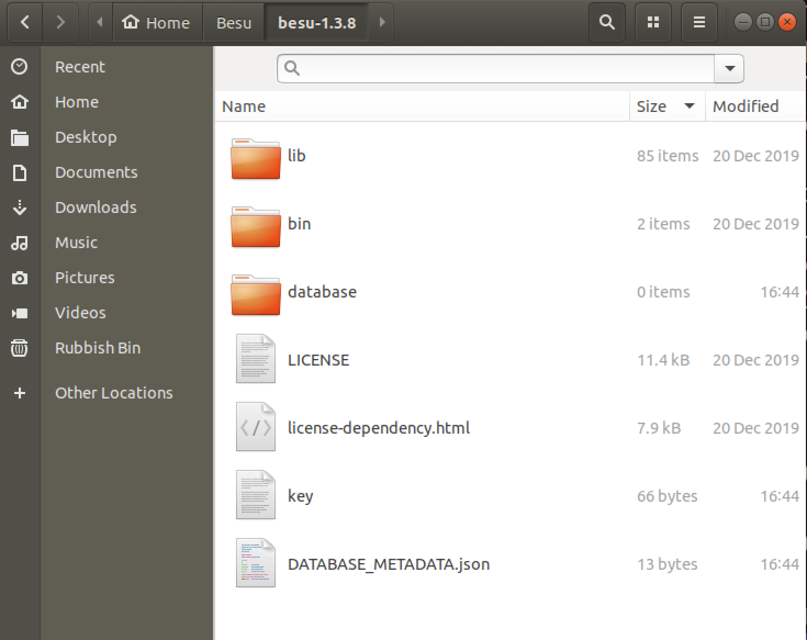

# Starting the Besu client

Starting the Hyperledger Besu client is as simple as running the command 

```text
./besu
```

but it is important to understand what is happening in the background. This command by  default connects to Ethereum Mainnet and downloads the Ethereum blockchain to a folder called database in the Besu installation directory.





Two other files, key and DATABASE\_METADATA.json can also be seen. 

