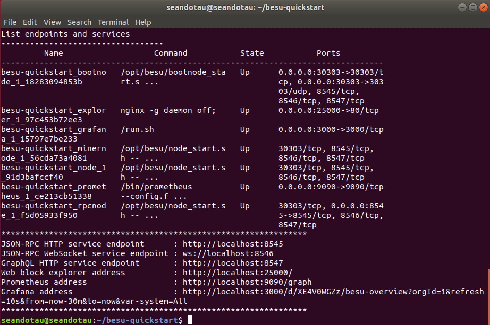

# 03 Creating a private network with Docker

In this section, we will demonstrate how to set up a private Hyperledger Besu network using Docker. Docker is a tool designed to make it easier to create, deploy, and run applications by using a concept  called containers. The friendly team at PegaSys Engineering have pre-created a Besu Docker container to enable anyone to create a private network very quickly.

### Highlevel commands

Git clone the Besu quickstart guide and then run the "run.sh" script.

```text
git clone https://github.com/PegaSysEng/besu-quickstart.git
cd besu-quickstart
./run.sh
```


If you don't have git installed, use "sudo apt install git".



You will need to have Docker installed and running otherwise you will get this error when you execute ./run.sh **"**This script requires Docker but it's not installed. Refer to quickstart documentation to fulfill requirements".


## Installing Docker on Ubuntu \(using default repository\)

First, let's update the local database of software to ensure we've got access to the latest revisions.

```text
sudo apt-get update
```

Then let's uninstall any old version of Docker. This is also useful if you want to practise the installation process to really understand what is happening. 

```text
sudo apt-get remove docker.io
```

Sometimes you'll need to remove additional packages such as docker and docker engine but usually this is not required. Next, let's install docker.

```text
sudo apt install docker.io
```

If you try to execute the run script again, you'll get another error. This time mentioning Docker compose. "This script requires Docker compose but it's not installed". Install Docker compose with the following command. 

```text
sudo curl -L "https://github.com/docker/compose/releases/download/1.23.1/docker-compose-$(uname -s)-$(uname -m)" -o /usr/local/bin/docker-compose
```


If you have installed a stripped down version of Ubuntu, you might not have curl installed resulting in a "curl: command not found". Install curl with:


```text
sudo apt install curl
```

Then grant Docker Compose the correct permissions.

```text
sudo chmod +x /usr/local/bin/docker-compose
```

If you try and run the script and encounter this error, "This script requires Docker daemon to run", run these commands.

```text
sudo groupadd docker // create a docker group
sudo usermod -aG docker $(whoami) //add current user to the docker group
sudo service docker start // start Docker
```

Now executing

```text
./run.sh
```

should yield the following successful output.



